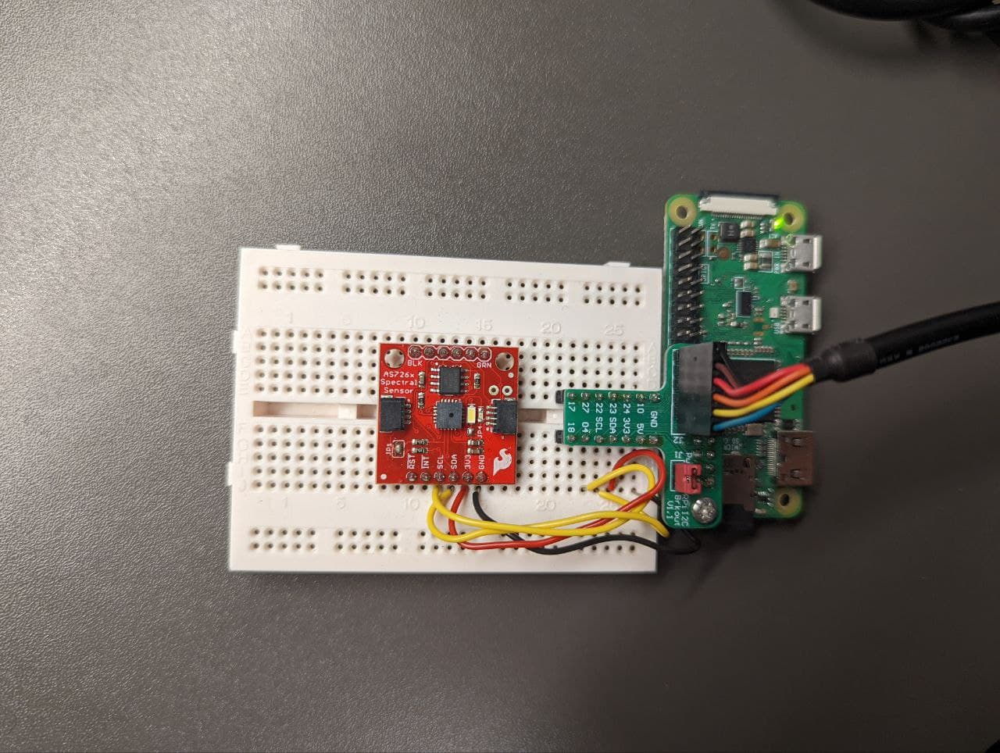

# [VisiBLUE *Smart glasses that keep an eye out of you*](https://yeungken.wixsite.com/visiblue)

## Project Description
VisiBLUE is an IoT connected digital healthcare service that takes care of the eyes of our clients. It makes use of an As726x spectral sensor interfaced with a Raspberry Pi Zero. Through the sensor, the smart VisiBLUE glasses will make decisions on whether our users are exposed to too high amounts of light or too high amounts of Harmful Energy Visible Light (HEV). 

Depending on the type of subscriptions our users are enrolled to, the following steps may be taken: 
1. Light polarizers and HEV filters fitted onto the smart VisiBLUE glasses will be actuated
2. A Telegram notification alerting them of high light intensities and high HEV intensities will be sent at appropriate intervals (to prevent spamming) and at appropriate times of the day (e.g. 2 hours before their desired sleep time)
3. Long-term trend of their exposure to high intensity of light and HEV will be logged on a website for users personal tracking

Future work for this project may include the use of lightweight machine learning models (e.g. Logistic Regression/SVM) to perform binary classification between natural and artifical light. This will give us the abiltity to generate more accurate alerts and filter actuations for users. This is because we acknowledge that high light intensities and strong HEV intensities due to natural light may sometimes be unavoidable. 

## Structure of this Repo
The Raspberry Pi is set up as such with the As726x sensor: 

There are three parts to this repo: 
1. piHost 
visiBlue_brain.py periodically (every x seconds) takes in sensor readings, and process them according to a variable threshold. Depending on the user, it will then make decisions, such as whether to activate the respective filters in the smart glasses, or whether to send the user a telegram alert, or whether to log the data in a server for long-term trend analysis of a users light-exposure history. This data is transmitted through MQTT to the local laptop client server.

2. laptopClient 
visiBlue_receiver.py subscribes to the data sent periodically (every 10x seconds)

3. laptopWebsite

